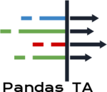

<p align="center">
  <a href="https://github.com/twopirllc/pandas_ta">
    
  </a>
</p>

Pandas TA - A Technical Analysis Library in Python 3
=================

[](#license)
[](https://pypi.org/project/pandas_ta/)
[](https://pypi.org/project/pandas_ta/)
[](https://pypi.org/project/pandas_ta/)
[](https://pypistats.org/packages/pandas_ta)
[](#stars)
[](#forks)
[](#usedby)
[](#contributors)
[](#issues)
[](#closed-issues)
[](https://www.buymeacoffee.com/twopirllc)


_Pandas Technical Analysis_ (**Pandas TA**) is an easy to use library that leverages the Pandas package with more than 130 Indicators and Utility functions and more than 60 TA Lib Candlestick Patterns. Many commonly used indicators are included, such as: _Candle Pattern_(**cdl_pattern**), _Simple Moving Average_ (**sma**) _Moving Average Convergence Divergence_ (**macd**), _Hull Exponential Moving Average_ (**hma**), _Bollinger Bands_ (**bbands**), _On-Balance Volume_ (**obv**), _Aroon & Aroon Oscillator_ (**aroon**), _Squeeze_ (**squeeze**) and **_many more_**.


**Note:** _TA Lib_ must be installed to use **all** the Candlestick Patterns. ```pip install TA-Lib```. If _TA Lib_ is not installed, then only the builtin Candlestick Patterns will be available.

<br/>

# **Table of contents**

<!--ts-->
* [Features](#features)
* [Installation](#installation)
    * [Stable](#stable)
    * [Latest Version](#latest-version)
    * [Cutting Edge](#cutting-edge)
* [Quick Start](#quick-start)
* [Help](#help)
* [Issues and Contributions](#issues-and-contributions)
* [Programming Conventions](#programming-conventions)
    * [Standard](#standard)
    * [Pandas TA DataFrame Extension](#pandas-ta-dataframe-extension)
    * [Pandas TA Strategy](#pandas-ta-strategy)
* [Pandas TA Strategies](#pandas-ta-strategies)
    * [Types of Strategies](#types-of-strategies)
    * [Multiprocessing](#multiprocessing)
* [DataFrame Properties](#dataframe-properties)
* [DataFrame Methods](#dataframe-methods)
* [Indicators by Category](#indicators-by-category)
    * [Candles](#candles-64)
    * [Cycles](#cycles-1)
    * [Momentum](#momentum-41)
    * [Overlap](#overlap-32)
    * [Performance](#performance-3)
    * [Statistics](#statistics-11)
    * [Trend](#trend-18)
    * [Utility](#utility-5)
    * [Volatility](#volatility-14)
    * [Volume](#volume-15)
* [Performance Metrics](#performance-metrics)
* [Changes](#changes)
    * [General](#general)
    * [Breaking Indicators](#breaking-indicators)
    * [New Indicators](#new-indicators)
    * [Updated Indicators](#updated-indicators)
* [Sources](#sources)
* [Support](#support)
<!--te-->

<!-- * [Specifying Strategies in **Pandas TA**](#specifying-strategies-in-pandas-ta) -->
<!-- * [Multiprocessing](#multiprocessing) -->


<br/>

# **Features**

* Has 130+ indicators and utility functions.
    * **BETA** Also Pandas TA will run TA Lib's version, this includes TA Lib's 63 Chart Patterns.
* Indicators are tightly correlated with the de facto [TA Lib](https://github.com/mrjbq7/ta-lib) if they share common indicators.
* Example Jupyter Notebook with **vectorbt** Portfolio Backtesting with Pandas TA's ```ta.tsignals``` method.
* Have the need for speed? By using the DataFrame _strategy_ method, you get **multiprocessing** for free! __Conditions permitting__.
* Easily add _prefixes_ or _suffixes_ or _both_ to columns names. Useful for Custom Chained Strategies.
* Example Jupyter Notebooks under the [examples](https://github.com/twopirllc/pandas-ta/tree/main/examples) directory, including how to create Custom Strategies using the new [__Strategy__ Class](https://github.com/twopirllc/pandas-ta/tree/main/examples/PandaTA_Strategy_Examples.ipynb)
* Potential Data Leaks: **ichimoku** and **dpo**. See indicator list below for details. Set ```lookahead=False``` to disable.

<br/>

**Under Development**
===================
**Pandas TA** checks if the user has some common trading packages installed including but not limited to: [**TA Lib**](https://mrjbq7.github.io/ta-lib/), [**Vector BT**](https://github.com/polakowo/vectorbt), [**YFinance**](https://github.com/ranaroussi/yfinance) ... Much of which is experimental and likely to break until it stabilizes more.
* If **TA Lib** installed, existing indicators will _eventually_ get a **TA Lib** version.
* Easy Downloading of _ohlcv_ data using [yfinance](https://github.com/ranaroussi/yfinance). See ```help(ta.ticker)``` and ```help(ta.yf)``` and examples below.
* Hopefully soon a Pandas TA _YAML_ configuration file contained in ```~/pandas_ta/``` can be implemented. To see the proposed specification and leave comments and suggestions on it's implementation, see Issue [#258](https://github.com/twopirllc/pandas-ta/issues/258).
* Some Common Performance Metrics

<br/>

**Installation**
===================

Stable
------
The ```pip``` version is the last stable release. Version: *0.3.02b*
```sh
$ pip install pandas_ta
```

Latest Version
--------------
Best choice! Version: *0.3.03b*
* Includes all fixes and updates between **pypi** and what is covered in this README.
```sh
$ pip install -U git+https://github.com/twopirllc/pandas-ta
```

Cutting Edge
------------
This is the _Development Version_ which could have bugs and other undesireable side effects. Use at own risk!
```sh
$ pip install -U git+https://github.com/twopirllc/pandas-ta.git@development
```

<br/>

 # **Quick Start**
```python
import pandas as pd
import pandas_ta as ta

df = pd.DataFrame() # Empty DataFrame

# Load data
df = pd.read_csv("path/to/symbol.csv", sep=",")
# OR if you have yfinance installed
df = df.ta.ticker("aapl")

# VWAP requires the DataFrame index to be a DatetimeIndex.
# Replace "datetime" with the appropriate column from your DataFrame
df.set_index(pd.DatetimeIndex(df["datetime"]), inplace=True)

# Calculate Returns and append to the df DataFrame
df.ta.log_return(cumulative=True, append=True)
df.ta.percent_return(cumulative=True, append=True)

# New Columns with results
df.columns

# Take a peek
df.tail()

# vv Continue Post Processing vv
```

<br/>

# **Help**
```python
import pandas as pd
import pandas_ta as ta

# Create a DataFrame so 'ta' can be used.
df = pd.DataFrame()

# Help about this, 'ta', extension
help(df.ta)

# List of all indicators
df.ta.indicators()

# Help about an indicator such as bbands
help(ta.bbands)
```
<br/>

# **Issues and Contributions**

Thanks for using **Pandas TA**!
<br/>

* ### [Comments and Feedback](https://github.com/twopirllc/pandas-ta/issues)
    * Have you read **_this_** document?
    * Are you running the latest version?
        * ```$ pip install -U git+https://github.com/twopirllc/pandas-ta```
    * Have you tried the [Examples](https://github.com/twopirllc/pandas-ta/tree/main/examples/)?
        * Did they help?
        * What is missing?
        * Could you help improve them?
    * Did you know you can easily build _Custom Strategies_ with the **[Strategy](https://github.com/twopirllc/pandas-ta/blob/main/examples/PandasTA_Strategy_Examples.ipynb) Class**?
    * Documentation could _always_ be improved. Can you help contribute?

* ### [Bugs, Indicators or Feature Requests](https://github.com/twopirllc/pandas-ta/issues)
    * First, search the _Closed_ Issues **before** you _Open_ a new Issue; it may have already been solved.
    * Please be as **detailed** as possible _with_ reproducible code, links if any, applicable screenshots, errors, logs, and data samples. You **will** be asked again if you provide nothing.
        * You want a new indicator not currently listed.
        * You want an alternate version of an existing indicator.
        * The indicator does not match another website, library, broker platform, language, et al.
            * Do you have correlation analysis to back your claim?
            * Can you contribute?
    * You **will** be asked to fill out an Issue even if you email my personally.


<br/>

**Contributors**
================

_Thank you for your contributions!_ 

<a href="https://github.com/AbyssAlora"></a> <a href="https://github.com/alexonab"></a> <a href="https://github.com/allahyarzadeh"></a> <a href="https://github.com/bizso09"></a> <a href="https://github.com/CMobley7"></a> <a href="https://github.com/codesutras"></a> <a href="https://github.com/DannyMartens"></a> <a href="https://github.com/DrPaprikaa"></a> <a href="https://github.com/daikts"></a> <a href="https://github.com/delicateear"></a> <a href="https://github.com/dorren"></a> <a href="https://github.com/edwardwang1"></a> <a href="https://github.com/FGU1"></a> <a href="https://github.com/ffhirata"></a> <a href="https://github.com/floatinghotpot"></a> <a href="https://github.com/GSlinger"></a> <a href="https://github.com/JoeSchr"></a> <a href="https://github.com/lluissalord"></a> <a href="https://github.com/luisbarrancos"></a> <a href="https://github.com/M6stafa"></a> <a href="https://github.com/maxdignan"></a> <a href="https://github.com/mchant"></a> <a href="https://github.com/moritzgun"></a> <a href="https://github.com/nicoloridulfo"></a> <a href="https://github.com/NkosenhleDuma"></a> <a href="https://github.com/pbrumblay"></a> <a href="https://github.com/RajeshDhalange"></a> <a href="https://github.com/rengel8"></a> <a href="https://github.com/rluong003"></a> <a href="https://github.com/SoftDevDanial"></a> <a href="https://github.com/tg12"></a> <a href="https://github.com/twrobel"></a> <a href="https://github.com/WellMaybeItIs"></a> <a href="https://github.com/whubsch"></a> <a href="https://github.com/witokondoria"></a> <a href="https://github.com/wouldayajustlookatit"></a> <a href="https://github.com/YuvalWein"></a> <a href="https://github.com/zlpatel"></a>


<br/>

**Programming Conventions**
===========================

**Pandas TA** has three primary "styles" of processing Technical Indicators for your use case and/or requirements. They are: _Standard_, _DataFrame Extension_, and the _Pandas TA Strategy_. Each with increasing levels of abstraction for ease of use. As you become more familiar with **Pandas TA**, the simplicity and speed of using a _Pandas TA Strategy_ may become more apparent. Furthermore, you can create your own indicators through Chaining or Composition. Lastly, each indicator either returns a _Series_ or a _DataFrame_ in Uppercase Underscore format regardless of style.

<br/>

_Standard_
====================
You explicitly define the input columns and take care of the output.

* ```sma10 = ta.sma(df["Close"], length=10)```
    * Returns a Series with name: ```SMA_10```
* ```donchiandf = ta.donchian(df["HIGH"], df["low"], lower_length=10, upper_length=15)```
    * Returns a DataFrame named ```DC_10_15``` and column names: ```DCL_10_15, DCM_10_15, DCU_10_15```
* ```ema10_ohlc4 = ta.ema(ta.ohlc4(df["Open"], df["High"], df["Low"], df["Close"]), length=10)```
    * Chaining indicators is possible but you have to be explicit.
    * Since it returns a Series named ```EMA_10```. If needed, you may need to uniquely name it.

<br/>

_Pandas TA DataFrame Extension_
====================

Calling ```df.ta``` will automatically lowercase _OHLCVA_ to _ohlcva_: _open, high, low, close, volume_, _adj_close_. By default, ```df.ta``` will use the _ohlcva_ for the indicator arguments removing the need to specify input columns directly.
* ```sma10 = df.ta.sma(length=10)```
    * Returns a Series with name: ```SMA_10```
* ```ema10_ohlc4 = df.ta.ema(close=df.ta.ohlc4(), length=10, suffix="OHLC4")```
    * Returns a Series with name: ```EMA_10_OHLC4```
    * Chaining Indicators _require_ specifying the input like: ```close=df.ta.ohlc4()```.
* ```donchiandf = df.ta.donchian(lower_length=10, upper_length=15)```
    * Returns a DataFrame named ```DC_10_15``` and column names: ```DCL_10_15, DCM_10_15, DCU_10_15```

Same as the last three examples, but appending the results directly to the DataFrame ```df```.
* ```df.ta.sma(length=10, append=True)```
    * Appends to ```df``` column name: ```SMA_10```.
* ```df.ta.ema(close=df.ta.ohlc4(append=True), length=10, suffix="OHLC4", append=True)```
    * Chaining Indicators _require_ specifying the input like: ```close=df.ta.ohlc4()```.
* ```df.ta.donchian(lower_length=10, upper_length=15, append=True)```
    * Appends to ```df``` with column names: ```DCL_10_15, DCM_10_15, DCU_10_15```.

<br/>

_Pandas TA Strategy_
====================

A **Pandas TA** Strategy is a named group of indicators to be run by the _strategy_ method. All Strategies use **mulitprocessing** _except_ when using the ```col_names``` parameter (see [below](#multiprocessing)). There are different types of _Strategies_ listed in the following section.

<br/>

### Here are the previous _Styles_ implemented using a Strategy Class:
```python
# (1) Create the Strategy
MyStrategy = ta.Strategy(
    name="DCSMA10",
    ta=[
        {"kind": "ohlc4"},
        {"kind": "sma", "length": 10},
        {"kind": "donchian", "lower_length": 10, "upper_length": 15},
        {"kind": "ema", "close": "OHLC4", "length": 10, "suffix": "OHLC4"},
    ]
)

# (2) Run the Strategy
df.ta.strategy(MyStrategy, **kwargs)
```

<br/><br/>

# **Pandas TA** _Strategies_

The _Strategy_ Class is a simple way to name and group your favorite TA Indicators by using a _Data Class_. **Pandas TA** comes with two prebuilt basic Strategies to help you get started: __AllStrategy__ and __CommonStrategy__. A _Strategy_ can be as simple as the __CommonStrategy__ or as complex as needed using Composition/Chaining.

* When using the _strategy_ method, **all** indicators will be automatically appended to the DataFrame ```df```.
* You are using a Chained Strategy when you have the output of one indicator as input into one or more indicators in the same _Strategy_.
* **Note:** Use the 'prefix' and/or 'suffix' keywords to distinguish the composed indicator from it's default Series.

See the [Pandas TA Strategy Examples Notebook](https://github.com/twopirllc/pandas-ta/blob/main/examples/PandasTA_Strategy_Examples.ipynb) for examples including _Indicator Composition/Chaining_.

Strategy Requirements
---------------------
- _name_: Some short memorable string.  _Note_: Case-insensitive "All" is reserved.
- _ta_: A list of dicts containing keyword arguments to identify the indicator and the indicator's arguments
- **Note:** A Strategy will fail when consumed by Pandas TA if there is no ```{"kind": "indicator name"}``` attribute. _Remember_ to check your spelling.

Optional Parameters
-------------------
- _description_: A more detailed description of what the Strategy tries to capture. Default: None
- _created_: At datetime string of when it was created. Default: Automatically generated.

<br/>

Types of Strategies
=======================

## _Builtin_
```python
# Running the Builtin CommonStrategy as mentioned above
df.ta.strategy(ta.CommonStrategy)

# The Default Strategy is the ta.AllStrategy. The following are equivalent:
df.ta.strategy()
df.ta.strategy("All")
df.ta.strategy(ta.AllStrategy)
```

## _Categorical_
```python
# List of indicator categories
df.ta.categories

# Running a Categorical Strategy only requires the Category name
df.ta.strategy("Momentum") # Default values for all Momentum indicators
df.ta.strategy("overlap", length=42) # Override all Overlap 'length' attributes
```

## _Custom_
```python
# Create your own Custom Strategy
CustomStrategy = ta.Strategy(
    name="Momo and Volatility",
    description="SMA 50,200, BBANDS, RSI, MACD and Volume SMA 20",
    ta=[
        {"kind": "sma", "length": 50},
        {"kind": "sma", "length": 200},
        {"kind": "bbands", "length": 20},
        {"kind": "rsi"},
        {"kind": "macd", "fast": 8, "slow": 21},
        {"kind": "sma", "close": "volume", "length": 20, "prefix": "VOLUME"},
    ]
)
# To run your "Custom Strategy"
df.ta.strategy(CustomStrategy)
```

<br/>

**Multiprocessing**
=======================

The **Pandas TA** _strategy_ method utilizes **multiprocessing** for bulk indicator processing of all Strategy types with **ONE EXCEPTION!** When using the ```col_names``` parameter to rename resultant column(s), the indicators in ```ta``` array will be ran in order.

```python
# VWAP requires the DataFrame index to be a DatetimeIndex.
# * Replace "datetime" with the appropriate column from your DataFrame
df.set_index(pd.DatetimeIndex(df["datetime"]), inplace=True)

# Runs and appends all indicators to the current DataFrame by default
# The resultant DataFrame will be large.
df.ta.strategy()
# Or the string "all"
df.ta.strategy("all")
# Or the ta.AllStrategy
df.ta.strategy(ta.AllStrategy)

# Use verbose if you want to make sure it is running.
df.ta.strategy(verbose=True)

# Use timed if you want to see how long it takes to run.
df.ta.strategy(timed=True)

# Choose the number of cores to use. Default is all available cores.
# For no multiprocessing, set this value to 0.
df.ta.cores = 4

# Maybe you do not want certain indicators.
# Just exclude (a list of) them.
df.ta.strategy(exclude=["bop", "mom", "percent_return", "wcp", "pvi"], verbose=True)

# Perhaps you want to use different values for indicators.
# This will run ALL indicators that have fast or slow as parameters.
# Check your results and exclude as necessary.
df.ta.strategy(fast=10, slow=50, verbose=True)

# Sanity check. Make sure all the columns are there
df.columns
```

<br/>

## Custom Strategy without Multiprocessing
**Remember** These will not be utilizing **multiprocessing**
```python
NonMPStrategy = ta.Strategy(
    name="EMAs, BBs, and MACD",
    description="Non Multiprocessing Strategy by rename Columns",
    ta=[
        {"kind": "ema", "length": 8},
        {"kind": "ema", "length": 21},
        {"kind": "bbands", "length": 20, "col_names": ("BBL", "BBM", "BBU")},
        {"kind": "macd", "fast": 8, "slow": 21, "col_names": ("MACD", "MACD_H", "MACD_S")}
    ]
)
# Run it
df.ta.strategy(NonMPStrategy)
```

<br/><br/>


# **DataFrame Properties**

## **adjusted**

```python
# Set ta to default to an adjusted column, 'adj_close', overriding default 'close'.
df.ta.adjusted = "adj_close"
df.ta.sma(length=10, append=True)

# To reset back to 'close', set adjusted back to None.
df.ta.adjusted = None
```

## **categories**

```python
# List of Pandas TA categories.
df.ta.categories
```

## **cores**

```python
# Set the number of cores to use for strategy multiprocessing
# Defaults to the number of cpus you have.
df.ta.cores = 4

# Set the number of cores to 0 for no multiprocessing.
df.ta.cores = 0

# Returns the number of cores you set or your default number of cpus.
df.ta.cores
```

## **datetime_ordered**

```python
# The 'datetime_ordered' property returns True if the DataFrame
# index is of Pandas datetime64 and df.index[0] < df.index[-1].
# Otherwise it returns False.
df.ta.datetime_ordered
```

## **exchange**

```python
# Sets the Exchange to use when calculating the last_run property. Default: "NYSE"
df.ta.exchange

# Set the Exchange to use.
# Available Exchanges: "ASX", "BMF", "DIFX", "FWB", "HKE", "JSE", "LSE", "NSE", "NYSE", "NZSX", "RTS", "SGX", "SSE", "TSE", "TSX"
df.ta.exchange = "LSE"
```

## **last_run**

```python
# Returns the time Pandas TA was last run as a string.
df.ta.last_run
```

## **reverse**

```python
# The 'reverse' is a helper property that returns the DataFrame
# in reverse order.
df.ta.reverse
```

## **prefix & suffix**

```python
# Applying a prefix to the name of an indicator.
prehl2 = df.ta.hl2(prefix="pre")
print(prehl2.name)  # "pre_HL2"

# Applying a suffix to the name of an indicator.
endhl2 = df.ta.hl2(suffix="post")
print(endhl2.name)  # "HL2_post"

# Applying a prefix and suffix to the name of an indicator.
bothhl2 = df.ta.hl2(prefix="pre", suffix="post")
print(bothhl2.name)  # "pre_HL2_post"
```

## **time_range**

```python
# Returns the time range of the DataFrame as a float.
# By default, it returns the time in "years"
df.ta.time_range

# Available time_ranges include: "years", "months", "weeks", "days", "hours", "minutes". "seconds"
df.ta.time_range = "days"
df.ta.time_range # prints DataFrame time in "days" as float
```

## **to_utc**

```python
# Sets the DataFrame index to UTC format.
df.ta.to_utc
```

<br/><br/>


# **DataFrame Methods**

## **constants**

```python
import numpy as np

# Add constant '1' to the DataFrame
df.ta.constants(True, [1])
# Remove constant '1' to the DataFrame
df.ta.constants(False, [1])

# Adding constants for charting
import numpy as np
chart_lines = np.append(np.arange(-4, 5, 1), np.arange(-100, 110, 10))
df.ta.constants(True, chart_lines)
# Removing some constants from the DataFrame
df.ta.constants(False, np.array([-60, -40, 40, 60]))
```

## **indicators**

```python
# Prints the indicators and utility functions
df.ta.indicators()

# Returns a list of indicators and utility functions
ind_list = df.ta.indicators(as_list=True)

# Prints the indicators and utility functions that are not in the excluded list
df.ta.indicators(exclude=["cg", "pgo", "ui"])
# Returns a list of the indicators and utility functions that are not in the excluded list
smaller_list = df.ta.indicators(exclude=["cg", "pgo", "ui"], as_list=True)
```

## **ticker**

```python
# Download Chart history using yfinance. (pip install yfinance) https://github.com/ranaroussi/yfinance
# It uses the same keyword arguments as yfinance (excluding start and end)
df = df.ta.ticker("aapl") # Default ticker is "SPY"

# Period is used instead of start/end
# Valid periods: 1d,5d,1mo,3mo,6mo,1y,2y,5y,10y,ytd,max
# Default: "max"
df = df.ta.ticker("aapl", period="1y") # Gets this past year

# History by Interval by interval (including intraday if period < 60 days)
# Valid intervals: 1m,2m,5m,15m,30m,60m,90m,1h,1d,5d,1wk,1mo,3mo
# Default: "1d"
df = df.ta.ticker("aapl", period="1y", interval="1wk") # Gets this past year in weeks
df = df.ta.ticker("aapl", period="1mo", interval="1h") # Gets this past month in hours

# BUT WAIT!! THERE'S MORE!!
help(ta.yf)
```

<br/><br/>

# **Indicators** (_by Category_)
### **Candles** (64)
Patterns that are **not bold**, require TA-Lib to be installed: ```pip install TA-Lib```

* 2crows
* 3blackcrows
* 3inside
* 3linestrike
* 3outside
* 3starsinsouth
* 3whitesoldiers
* abandonedbaby
* advanceblock
* belthold
* breakaway
* closingmarubozu
* concealbabyswall
* counterattack
* darkcloudcover
* **doji**
* dojistar
* dragonflydoji
* engulfing
* eveningdojistar
* eveningstar
* gapsidesidewhite
* gravestonedoji
* hammer
* hangingman
* harami
* haramicross
* highwave
* hikkake
* hikkakemod
* homingpigeon
* identical3crows
* inneck
* **inside**
* invertedhammer
* kicking
* kickingbylength
* ladderbottom
* longleggeddoji
* longline
* marubozu
* matchinglow
* mathold
* morningdojistar
* morningstar
* onneck
* piercing
* rickshawman
* risefall3methods
* separatinglines
* shootingstar
* shortline
* spinningtop
* stalledpattern
* sticksandwich
* takuri
* tasukigap
* thrusting
* tristar
* unique3river
* upsidegap2crows
* xsidegap3methods
* _Heikin-Ashi_: **ha**
* _Z Score_: **cdl_z**
```python
# Get all candle patterns (This is the default behaviour)
df = df.ta.cdl_pattern(name="all")

# Get only one pattern
df = df.ta.cdl_pattern(name="doji")

# Get some patterns
df = df.ta.cdl_pattern(name=["doji", "inside"])
```
<br/>


### **Cycles** (1)
* _Even Better Sinewave_: **ebsw**

<br/>

### **Momentum** (41)
* _Awesome Oscillator_: **ao**
* _Absolute Price Oscillator_: **apo**
* _Bias_: **bias**
* _Balance of Power_: **bop**
* _BRAR_: **brar**
* _Commodity Channel Index_: **cci**
* _Chande Forecast Oscillator_: **cfo**
* _Center of Gravity_: **cg**
* _Chande Momentum Oscillator_: **cmo**
* _Coppock Curve_: **coppock**
* _Correlation Trend Indicator_: **cti**
    * A wrapper for ```ta.linreg(series, r=True)```
* _Directional Movement_: **dm**
* _Efficiency Ratio_: **er**
* _Elder Ray Index_: **eri**
* _Fisher Transform_: **fisher**
* _Inertia_: **inertia**
* _KDJ_: **kdj**
* _KST Oscillator_: **kst**
* _Moving Average Convergence Divergence_: **macd**
* _Momentum_: **mom**
* _Pretty Good Oscillator_: **pgo**
* _Percentage Price Oscillator_: **ppo**
* _Psychological Line_: **psl**
* _Percentage Volume Oscillator_: **pvo**
* _Quantitative Qualitative Estimation_: **qqe**
* _Rate of Change_: **roc**
* _Relative Strength Index_: **rsi**
* _Relative Strength Xtra_: **rsx**
* _Relative Vigor Index_: **rvgi**
* _Schaff Trend Cycle_: **stc**
* _Slope_: **slope**
* _SMI Ergodic_ **smi**
* _Squeeze_: **squeeze**
    * Default is John Carter's. Enable Lazybear's with ```lazybear=True```
* _Squeeze Pro_: **squeeze_pro**
* _Stochastic Oscillator_: **stoch**
* _Stochastic RSI_: **stochrsi**
* _TD Sequential_: **td_seq**
    * Excluded from ```df.ta.strategy()```.
* _Trix_: **trix**
* _True strength index_: **tsi**
* _Ultimate Oscillator_: **uo**
* _Williams %R_: **willr**


| _Moving Average Convergence Divergence_ (MACD) |
|:--------:|
|  |

<br/>

### **Overlap** (32)

* _Arnaud Legoux Moving Average_: **alma**
* _Double Exponential Moving Average_: **dema**
* _Exponential Moving Average_: **ema**
* _Fibonacci's Weighted Moving Average_: **fwma**
* _Gann High-Low Activator_: **hilo**
* _High-Low Average_: **hl2**
* _High-Low-Close Average_: **hlc3**
    * Commonly known as 'Typical Price' in Technical Analysis literature
* _Hull Exponential Moving Average_: **hma**
* _Holt-Winter Moving Average_: **hwma**
* _Ichimoku Kinkō Hyō_: **ichimoku**
    * Returns two DataFrames. For more information: ```help(ta.ichimoku)```.
    * ```lookahead=False``` drops the Chikou Span Column to prevent potential data leak.
* _Kaufman's Adaptive Moving Average_: **kama**
* _Linear Regression_: **linreg**
* _McGinley Dynamic_: **mcgd**
* _Midpoint_: **midpoint**
* _Midprice_: **midprice**
* _Open-High-Low-Close Average_: **ohlc4**
* _Pascal's Weighted Moving Average_: **pwma**
* _WildeR's Moving Average_: **rma**
* _Sine Weighted Moving Average_: **sinwma**
* _Simple Moving Average_: **sma**
* _Ehler's Super Smoother Filter_: **ssf**
* _Supertrend_: **supertrend**
* _Symmetric Weighted Moving Average_: **swma**
* _T3 Moving Average_: **t3**
* _Triple Exponential Moving Average_: **tema**
* _Triangular Moving Average_: **trima**
* _Variable Index Dynamic Average_: **vidya**
* _Volume Weighted Average Price_: **vwap**
    * **Requires** the DataFrame index to be a DatetimeIndex
* _Volume Weighted Moving Average_: **vwma**
* _Weighted Closing Price_: **wcp**
* _Weighted Moving Average_: **wma**
* _Zero Lag Moving Average_: **zlma**

| _Simple Moving Averages_ (SMA) and _Bollinger Bands_ (BBANDS) |
|:--------:|
|  |

<br/>

### **Performance** (3)

Use parameter: cumulative=**True** for cumulative results.

* _Draw Down_: **drawdown**
* _Log Return_: **log_return**
* _Percent Return_: **percent_return**

| _Percent Return_ (Cumulative) with _Simple Moving Average_ (SMA) |
|:--------:|
|  |
<br/>

### **Statistics** (11)

* _Entropy_: **entropy**
* _Kurtosis_: **kurtosis**
* _Mean Absolute Deviation_: **mad**
* _Median_: **median**
* _Quantile_: **quantile**
* _Skew_: **skew**
* _Standard Deviation_: **stdev**
* _Think or Swim Standard Deviation All_: **tos_stdevall**
* _Variance_: **variance**
* _Z Score_: **zscore**

| _Z Score_ |
|:--------:|
|  |
<br/>

### **Trend** (18)

* _Average Directional Movement Index_: **adx**
    * Also includes **dmp** and **dmn** in the resultant DataFrame.
* _Archer Moving Averages Trends_: **amat**
* _Aroon & Aroon Oscillator_: **aroon**
* _Choppiness Index_: **chop**
* _Chande Kroll Stop_: **cksp**
* _Decay_: **decay**
    * Formally: **linear_decay**
* _Decreasing_: **decreasing**
* _Detrended Price Oscillator_: **dpo**
    * Set ```lookahead=False``` to disable centering and remove potential data leak.
* _Increasing_: **increasing**
* _Long Run_: **long_run**
* _Parabolic Stop and Reverse_: **psar**
* _Q Stick_: **qstick**
* _Short Run_: **short_run**
* _Trend Signals_: **tsignals**
* _TTM Trend_: **ttm_trend**
* _Vertical Horizontal Filter_: **vhf**
* _Vortex_: **vortex**
* _Cross Signals_: **xsignals**

| _Average Directional Movement Index_ (ADX) |
|:--------:|
|  |

<br/>

### **Utility** (5)

* _Above_: **above**
* _Above Value_: **above_value**
* _Below_: **below**
* _Below Value_: **below_value**
* _Cross_: **cross**

<br/>

### **Volatility** (14)

* _Aberration_: **aberration**
* _Acceleration Bands_: **accbands**
* _Average True Range_: **atr**
* _Bollinger Bands_: **bbands**
* _Donchian Channel_: **donchian**
* _Holt-Winter Channel_: **hwc**
* _Keltner Channel_: **kc**
* _Mass Index_: **massi**
* _Normalized Average True Range_: **natr**
* _Price Distance_: **pdist**
* _Relative Volatility Index_: **rvi**
* _Elder's Thermometer_: **thermo**
* _True Range_: **true_range**
* _Ulcer Index_: **ui**

| _Average True Range_ (ATR) |
|:--------:|
|  |

<br/>

### **Volume** (15)

* _Accumulation/Distribution Index_: **ad**
* _Accumulation/Distribution Oscillator_: **adosc**
* _Archer On-Balance Volume_: **aobv**
* _Chaikin Money Flow_: **cmf**
* _Elder's Force Index_: **efi**
* _Ease of Movement_: **eom**
* _Klinger Volume Oscillator_: **kvo**
* _Money Flow Index_: **mfi**
* _Negative Volume Index_: **nvi**
* _On-Balance Volume_: **obv**
* _Positive Volume Index_: **pvi**
* _Price-Volume_: **pvol**
* _Price Volume Rank_: **pvr**
* _Price Volume Trend_: **pvt**
* _Volume Profile_: **vp**

| _On-Balance Volume_ (OBV) |
|:--------:|
|  |

<br/><br/>

# **Performance Metrics** &nbsp; _BETA_
_Performance Metrics_ are a **new** addition to the package and consequentially are likely unreliable. **Use at your own risk.** These metrics return a _float_ and are _not_ part of the _DataFrame_ Extension. They are called the Standard way. For Example:

```python
import pandas_ta as ta
result = ta.cagr(df.close)
```

### Available Metrics
* _Compounded Annual Growth Rate_: **cagr**
* _Calmar Ratio_: **calmar_ratio**
* _Downside Deviation_: **downside_deviation**
* _Jensen's Alpha_: **jensens_alpha**
* _Log Max Drawdown_: **log_max_drawdown**
* _Max Drawdown_: **max_drawdown**
* _Pure Profit Score_: **pure_profit_score**
* _Sharpe Ratio_: **sharpe_ratio**
* _Sortino Ratio_: **sortino_ratio**
* _Volatility_: **volatility**

<br/>

## Backtesting with **vectorbt**
For **easier** integration with **vectorbt**'s Portfolio ```from_signals``` method, the ```ta.trend_return``` method has been replaced with ```ta.tsignals``` method to simplify the generation of trading signals. For a comprehensive example, see the example Jupyter Notebook [VectorBT Backtest with Pandas TA](https://github.com/twopirllc/pandas-ta/blob/main/examples/VectorBT_Backtest_with_Pandas_TA.ipynb) in the examples directory.

<br/>

### Brief example
* See the [**vectorbt**](https://polakowo.io/vectorbt/) website more options and examples.
```python
import pandas as pd
import pandas_ta as ta
import vectorbt as vbt

df = pd.DataFrame().ta.ticker("AAPL") # requires 'yfinance' installed

# Create the "Golden Cross" 
df["GC"] = df.ta.sma(50, append=True) > df.ta.sma(200, append=True)

# Create boolean Signals(TS_Entries, TS_Exits) for vectorbt
golden = df.ta.tsignals(df.GC, asbool=True, append=True)

# Sanity Check (Ensure data exists)
print(df)

# Create the Signals Portfolio
pf = vbt.Portfolio.from_signals(df.close, entries=golden.TS_Entries, exits=golden.TS_Exits, freq="D", init_cash=100_000, fees=0.0025, slippage=0.0025)

# Print Portfolio Stats and Return Stats
print(pf.stats())
print(pf.returns_stats())
```


<br/><br/>

# **Changes**
## **General**
* A __Strategy__ Class to help name and group your favorite indicators.
* If a **TA Lib** is already installed, Pandas TA will run TA Lib's version. (**BETA**)
* Some indicators have had their ```mamode``` _kwarg_ updated with more _moving average_ choices with the **Moving Average Utility** function ```ta.ma()```. For simplicity, all _choices_ are single source _moving averages_. This is primarily an internal utility used by indicators that have a ```mamode``` _kwarg_. This includes indicators: _accbands_, _amat_, _aobv_, _atr_, _bbands_, _bias_, _efi_, _hilo_, _kc_, _natr_, _qqe_, _rvi_, and _thermo_; the default ```mamode``` parameters have not changed. However, ```ta.ma()``` can be used by the user as well if needed. For more information: ```help(ta.ma)```
    * **Moving Average Choices**: dema, ema, fwma, hma, linreg, midpoint, pwma, rma, sinwma, sma, swma, t3, tema, trima, vidya, wma, zlma.
* An _experimental_ and independent __Watchlist__ Class located in the [Examples](https://github.com/twopirllc/pandas-ta/tree/main/examples/watchlist.py) Directory that can be used in conjunction with the new __Strategy__ Class.
* _Linear Regression_ (**linear_regression**) is a new utility method for Simple Linear Regression using _Numpy_ or _Scikit Learn_'s implementation.
* Added utility/convience function, ```to_utc```, to convert the DataFrame index to UTC. See: ```help(ta.to_utc)``` **Now** as a Pandas TA DataFrame Property to easily convert the DataFrame index to UTC.

<br />

## **Breaking / Depreciated Indicators**
* _Trend Return_ (**trend_return**) has been removed and replaced with **tsignals**. When given a trend Series like ```close > sma(close, 50)``` it returns the Trend, Trade Entries and Trade Exits of that trend to make it compatible with [**vectorbt**](https://github.com/polakowo/vectorbt) by setting ```asbool=True``` to get boolean Trade Entries and Exits. See ```help(ta.tsignals)```

<br/>

## **New Indicators**
* _Arnaud Legoux Moving Average_ (**alma**) uses the curve of the Normal (Gauss) distribution to allow regulating the smoothness and high sensitivity of the indicator. See: ```help(ta.alma)```
trading account, or fund. See ```help(ta.drawdown)```
* _Candle Patterns_ (**cdl_pattern**) If TA Lib is installed, then all those Candle Patterns are available. See the list and examples above on how to call the patterns. See ```help(ta.cdl_pattern)```
* _Candle Z Score_ (**cdl_z**) normalizes OHLC Candles with a rolling Z Score. See ```help(ta.cdl_z)```
* _Correlation Trend Indicator_ (**cti**) is an oscillator created by John Ehler in 2020. See ```help(ta.cti)```
* _Cross Signals_ (**xsignals**) was created by Kevin Johnson. It is a wrapper of Trade Signals that returns Trends, Trades, Entries and Exits. Cross Signals are commonly used for **bbands**, **rsi**, **zscore** crossing some value either above or below two values at different times. See ```help(ta.xsignals)```
* _Directional Movement_ (**dm**) developed by J. Welles Wilder in 1978 attempts to determine which direction the price of an asset is moving. See ```help(ta.dm)```
* _Even Better Sinewave_ (**ebsw**) measures market cycles and uses a low pass filter to remove noise. See: ```help(ta.ebsw)```
* _Klinger Volume Oscillator_ (**kvo**) was developed by Stephen J. Klinger. It is designed to predict price reversals in a market by comparing volume to price.. See ```help(ta.kvo)```
* _Schaff Trend Cycle_ (**stc**) is an evolution of the popular MACD incorportating two cascaded stochastic calculations with additional smoothing. See ```help(ta.stc)```
* _Squeeze Pro_ (**squeeze_pro**) is an extended version of "TTM Squeeze" from John Carter. See ```help(ta.squeeze_pro)```
* _Tom DeMark's Sequential_ (**td_seq**) attempts to identify a price point where an uptrend or a downtrend exhausts itself and reverses. Currently exlcuded from ```df.ta.strategy()``` for performance reasons. See ```help(ta.td_seq)```
* _Think or Swim Standard Deviation All_ (**tos_stdevall**) indicator which
returns the standard deviation of data for the entire plot or for the interval
of the last bars defined by the length parameter. See ```help(ta.tos_stdevall)```
* _Vertical Horizontal Filter_ (**vhf**) was created by Adam White to identify trending and ranging markets.. See ```help(ta.vhf)```

<br/>

## **Updated Indicators**
* _ADX_ (**adx**): Added ```mamode``` with default "**RMA**" and with the same ```mamode``` options as TradingView. New argument ```lensig``` so it behaves like TradingView's builtin ADX indicator. See ```help(ta.adx)```.
* _Archer Moving Averages Trends_ (**amat**): Added ```drift``` argument and more descriptive column names.
* _Average True Range_ (**atr**): The default ```mamode``` is now "**RMA**" and with the same ```mamode``` options as TradingView. See ```help(ta.atr)```.
* _Bollinger Bands_ (**bbands**): New argument ```ddoff``` to control the Degrees of Freedom. Also included BB Percent (BBP) as the final column. Default is 0. See ```help(ta.bbands)```.
* _Choppiness Index_ (**chop**): New argument ```ln``` to use Natural Logarithm (True) instead of the Standard Logarithm (False). Default is False.  See ```help(ta.chop)```.
* _Chande Kroll Stop_ (**cksp**): Added ```tvmode``` with default ```True```. When ```tvmode=False```, **cksp** implements “The New Technical Trader” with default values. See ```help(ta.cksp)```.
* _Decreasing_ (**decreasing**): New argument ```strict``` checks if the series is continuously decreasing over period ```length``` with a faster calculation. Default: ```False```. The ```percent``` argument has also been added with default None. See ```help(ta.decreasing)```.
* _Increasing_ (**increasing**): New argument ```strict``` checks if the series is continuously increasing over period ```length``` with a faster calculation. Default: ```False```. The ```percent``` argument has also been added with default None. See ```help(ta.increasing)```.
* _Parabolic Stop and Reverse_ (**psar**): Bug fix and adjustment to match TradingView's ```sar```. New argument ```af0``` to initialize the Acceleration Factor. See ```help(ta.psar)```.
* _Percentage Price Oscillator_ (**ppo**): Included new argument ```mamode``` as an option. Default is **sma** to match TA Lib. See ```help(ta.ppo)```.
* _Volume Profile_ (**vp**): Calculation improvements. See [Pull Request #320](https://github.com/twopirllc/pandas-ta/pull/320) See ```help(ta.vp)```.
* _Volume Weighted Moving Average_ (**vwma**): Fixed bug in DataFrame Extension call. See ```help(ta.vwma)```.
* _Volume Weighted Average Price_ (**vwap**): Added a new parameter called ```anchor```. Default: "D" for "Daily". See [Timeseries Offset Aliases](https://pandas.pydata.org/pandas-docs/stable/user_guide/timeseries.html#timeseries-offset-aliases) for additional options. **Requires** the DataFrame index to be a DatetimeIndex. See ```help(ta.vwap)```.
* _Z Score_ (**zscore**): Changed return column name from ```Z_length``` to ```ZS_length```. See ```help(ta.zscore)```.

<br />

# **Sources**
[Original TA-LIB](http://ta-lib.org/) | [TradingView](http://www.tradingview.com) | [Sierra Chart](https://search.sierrachart.com/?Query=indicators&submitted=true) | [MQL5](https://www.mql5.com) | [FM Labs](https://www.fmlabs.com/reference/default.htm) | [Pro Real Code](https://www.prorealcode.com/prorealtime-indicators) | [User 42](https://user42.tuxfamily.org/chart/manual/index.html)

<br/>

# **Support**

Feeling generous, like the package or want to see it become more mature package? Please consider:

[](https://www.buymeacoffee.com/twopirllc)

